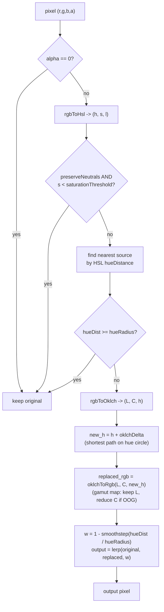

# change-image-theme

一个用于给 PNG/JPG 资源 **换主题 / 换肤** 的 Node.js CLI：用 hex 颜色映射表把品牌主色及其明暗变体整体迁到新色相，针对 **品牌重塑（rebrand）、白标、多主题皮肤** 比单纯「逐像素换色」更贴切。算法采用 **HSL 匹配 + OKLCH 转换** 的混合策略：用 HSL 色相归类要替换的像素，用 OKLCH 旋转 hue 并保留感知亮度（L）与色度（C）。

- **HSL 色相匹配**：按 HSL 色相距离判定像素是否属于品牌色及其变体，归类稳定、与 main 分支行为一致
- **OKLCH 色相旋转**：匹配到的像素在 OKLCH 空间旋转 hue，保留每个像素原本的**感知亮度**（L）与色度（C）
- **中性色保留**：低饱和度（HSL S）像素（白/灰/黑）被跳过，文字和背景不被破坏
- **色域映射**：旋转后若落出 sRGB，按 CSS Color 4 推荐方式 **保 L 降 C**，避免明度跳变
- **平滑边界**：smoothstep 在色相半径边缘软过渡，无锐利色块
- **Alpha 完整保留**（PNG 输出）
- **批量目录处理**：默认递归 + 保留目录结构 + 多文件并发

## 安装

```bash
npm install
npm run build
# 可选：全局链接（命令行工具名为 cit）
npm link
```

发布到 npm 后包名为 `change-image-theme`；本地开发可用 `npx change-image-theme …`（与全局的 `cit` 等价，均指向同一入口）。

开发模式直接跑 TS 源码：

```bash
npm run dev -- input.png -o output.png -m examples/mapping.json
```

## 颜色映射表

JSON 文件，键是源色（hex），值是目标色（hex），支持 `#rgb` 和 `#rrggbb`：

```json
{
  "#514cf9": "#f05416"
}
```

> **要点**：这里写的不是"精确像素颜色"，而是品牌的**代表色相**。算法用 **HSL 色相** 判断哪些像素要换，用映射表两端颜色的 **OKLCH 色相差** 作为旋转角度；每个像素自己的 OKLCH 明度（L）和色度（C）会被保留下来。所以纯品牌色 `#514cf9` 不一定恰好变成 `#f05416`，但它的所有明暗变体（深紫 icon、浅紫背景、品牌色按钮…）都会被一并迁移到橙色相，且 **明暗节奏保持原图风貌**。如果你需要把"恰好这一种颜色"变成"恰好那一种颜色"，本工具不是合适的选择。

## 用法

### 单文件

```bash
cit banner.png \
  -o banner-rebrand.png \
  -m examples/mapping.json
```

### 整个目录（默认递归，保留目录结构）

```bash
cit ./assets \
  -o ./assets-rebrand \
  -m examples/mapping.json
```

### 调整色相容差

`-r` / `--hue-radius` 控制"多近的色相视为同一品牌色"，单位为度（0–180）：

```bash
# 只换非常接近源色相的像素（保守）
cit in.png -o out.png -m map.json -r 15

# 默认：能覆盖品牌色变体，不波及邻近色相
cit in.png -o out.png -m map.json

# 连邻近色相也调换（宽松）
cit in.png -o out.png -m map.json -r 60
```

### 中性色保留阈值

`-t` / `--saturation-threshold` 默认 `0.1`，**HSL 饱和度** 低于该值的像素被视为中性色保留。如果你的品牌色变体里有非常浅的色调被误判为中性色，可以调小该值：

```bash
cit in.png -o out.png -m map.json -t 0.05
```

特殊场景：如果你确实要把白/灰也换掉，用 `--no-preserve-neutrals`：

```bash
cit in.png -o out.png -m map.json --no-preserve-neutrals
```

### 内联 JSON 映射

```bash
cit in.png -o out.png -m '{"#514cf9":"#f05416"}'
```

### 详细输出

```bash
cit in.png -o out.png -m map.json -v
```

输出样例：

```
OK  banner1.png (1200x720, affected 857302/858480 (skipped: neutral=263, far=743, transparent=172))
     #514cf9: 857302 px
```

## 全部 CLI 参数

| 参数 | 默认 | 说明 |
|---|---|---|
| `<input>` | – | 输入文件或目录（必填位置参数） |
| `-o, --output <path>` | – | 输出文件或目录（必填；输入为目录时此项必须是目录） |
| `-m, --map <jsonOrPath>` | – | 映射表：JSON 文件路径，或以 `{` 开头的内联 JSON |
| `-r, --hue-radius <degrees>` | `30` | HSL 色相距离半径（0–180°），范围内的像素会向目标色相旋转，边缘 smoothstep 衰减 |
| `-t, --saturation-threshold <number>` | `0.1` | HSL 饱和度低于此值的像素视为中性色，保留不变（范围 0–1） |
| `--no-preserve-neutrals` | – | 禁用中性色保留 |
| `--no-recursive` | – | 目录模式下关闭递归 |
| `-c, --concurrency <number>` | CPU 核心数 | 批量并发数（目录模式） |
| `-v, --verbose` | `false` | 打印每种源色的命中数 |

## 算法详解

### 步骤



### 关键点

- **HSL 匹配、OKLCH 转换**：归类阶段用 HSL 色相（与 CSS/设计工具习惯一致）；转换阶段在 OKLCH 保留 L 与 C，只旋转 hue，感知亮度跨色相恒定。
- **色相按最短路径旋转**：映射表两端颜色的 OKLCH 色相差（如源 `h=275.5°` → 目标 `h=38.4°`，delta `+122.9°`）应用于每个匹配像素。
- **色域映射（gamut map）**：浅色 + 旋转后可能落出 sRGB（OKLCH 是 sRGB 的超集）。算法采用 CSS Color Level 4 推荐策略：**保 L 不变，二分降 C** 直到入色域，再做线性 sRGB → sRGB 转换。结果是色度略微下降但明度准确，避免"保 C 降 L"带来的明暗错乱。
- **smoothstep 边缘衰减 + sRGB 混合**：在 hue 距离 `t = hueDist / hueRadius` 上用 `1 - smoothstep(t)` 计算权重，最终结果是原始 sRGB 与"旋转后 sRGB"的线性插值。
- **中性色判定**：HSL 饱和度 S 接近 0 的像素（白 / 灰 / 黑）低于 `saturationThreshold = 0.1`，自然被跳过。

### 为什么混合 HSL + OKLCH？

| 阶段 | 色彩空间 | 原因 |
|---|---|---|
| 像素归类（hue 距离、中性色） | **HSL** | 与设计工具/CSS 色相一致，浅色变体归类稳定 |
| 色相旋转（保明暗节奏） | **OKLCH** | L 是真感知亮度，跨色相恒定；自动 gamut-map（保 L 降 C） |

实测样张 `examples/input.png`（一张深浅不一的品牌紫 icon）→ `examples/output.png`：

- 浅紫 `#9476fd`（OKLCH L≈0.61）→ `#b9727d`（L≈0.61）
- 中紫 `#5b5bfa`（L≈0.55）→ `#ca4300`（L≈0.55）
- 深紫 `#2f45f7`（L≈0.45）→ `#a91f23`（L≈0.45）

整张图的明度阶梯完全对齐原图；如果用 HSL 同样的旋转，输出会整体偏亮 5–10%（因为同 L 的橙比紫感知更亮）。

## 注意事项

- **JPG 不支持透明度**：输出 `.jpg/.jpeg` 时透明像素会被压平为黑/白背景（sharp 默认）。需要保留透明度请输出为 `.png`。
- **同名覆盖**：目录模式默认覆盖输出文件，方便重跑。
- **批量容错**：单文件失败仅 `console.error` 并计数，不会中断整批；如有失败，进程退出码 `1`。
- **要把白/灰也换色** 时，传 `--no-preserve-neutrals`。这种场景较少见但保留了开关。
- **多个源色相靠近** 时：findNearestByHue 取最近的那个源色相做旋转，因此即便几个品牌色色相相近，结果仍然唯一确定。

## 项目结构

```
src/
├── cli.ts         # CLI 入口、参数解析、目录分发、并发池
├── color.ts       # hex<->RGB、HSL、OKLCH、gamut map、hue distance/delta
├── mapper.ts      # 映射表预解析（RGB & HSL & OKLCH & OKLCH hueDelta）、findNearestByHue(HSL)
├── processor.ts   # 单文件像素循环：HSL 匹配 -> OKLCH hue 旋转 -> 色域映射 -> sRGB 混合
├── walker.ts      # 目录递归扫描
└── types.ts       # 类型定义与默认参数
```

## License

MIT
