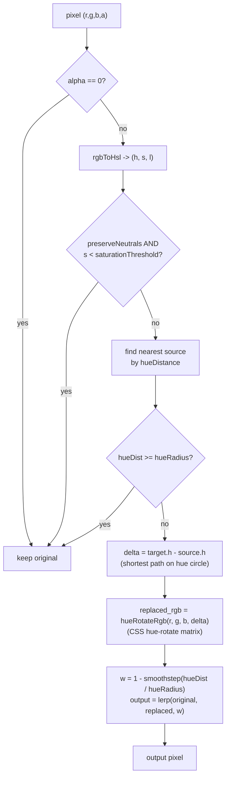

# change-images-theme

一个用于给 PNG/JPG 资源 **换主题 / 换肤** 的 Node.js CLI：用 hex 颜色映射表把品牌主色及其明暗变体整体迁到新色相，针对 **品牌重塑（rebrand）、白标、多主题皮肤** 比单纯「逐像素换色」更贴切。算法在 HSL 空间按色相归类匹配像素，再用 CSS `hue-rotate` 同款矩阵旋转色相，避免 HSL 中「只改 H、保留 S/L」导致的跨色相亮度不一致。

- **HSL 匹配 + hue-rotate 变换**：在 HSL 空间按色相距离判定目标像素，再用 CSS `hue-rotate` 矩阵旋转 RGB，感知亮度更一致
- **中性色保留**：低饱和度像素（白/灰/黑）天然被跳过，文字和背景不被破坏
- **平滑边界**：用 smoothstep 在色相半径边缘软过渡，无锐利色块
- **Alpha 完整保留**（PNG 输出）
- **批量目录处理**：默认递归 + 保留目录结构 + 多文件并发

## 安装

```bash
npm install
npm run build
# 可选：全局链接（命令行工具名为 cit）
npm link
```

发布到 npm 后包名为 `change-images-theme`；本地开发可用 `npx change-images-theme …`（与全局的 `cit` 等价，均指向同一入口）。

开发模式直接跑 TS 源码：

```bash
npm run dev -- input.png -o output.png -m examples/mapping.json
```

## 颜色映射表

JSON 文件，键是源色（hex），值是目标色（hex），支持 `#rgb` 和 `#rrggbb`：

```json
{
  "#514cf9": "#f05416"
}
```

> **要点**：这里写的不是"精确像素颜色"，而是品牌的**代表色**。算法会自动覆盖它的所有明暗变体。例如把品牌紫换成品牌橙，深紫 icon、浅紫背景、品牌色按钮都会被一并迁移。

## 用法

### 单文件

```bash
cit banner.png \
  -o banner-rebrand.png \
  -m examples/mapping.json
```

### 整个目录（默认递归，保留目录结构）

```bash
cit ./assets \
  -o ./assets-rebrand \
  -m examples/mapping.json
```

### 调整色相容差

`-r` / `--hue-radius` 控制"多近的色相视为同一品牌色"，单位为度（0–180）：

```bash
# 只换非常接近源色相的像素（保守）
cit in.png -o out.png -m map.json -r 15

# 默认：能覆盖品牌色变体，不波及邻近色相
cit in.png -o out.png -m map.json

# 连邻近色相也调换（宽松）
cit in.png -o out.png -m map.json -r 60
```

### 中性色保留阈值

`-t` / `--saturation-threshold` 默认 `0.10`，HSL 饱和度低于该值的像素被视为中性色保留。如果你的品牌色变体里有非常浅的色调被误判为中性色，可以调小该值：

```bash
cit in.png -o out.png -m map.json -t 0.05
```

特殊场景：如果你确实要把白/灰也换掉，用 `--no-preserve-neutrals`：

```bash
cit in.png -o out.png -m map.json --no-preserve-neutrals
```

### 内联 JSON 映射

```bash
cit in.png -o out.png -m '{"#514cf9":"#f05416"}'
```

### 详细输出

```bash
cit in.png -o out.png -m map.json -v
```

输出样例：

```
OK  banner1.png (1200x720, affected 857302/858480 (skipped: neutral=263, far=743, transparent=172))
     #514cf9: 857302 px
```

## 全部 CLI 参数

| 参数 | 默认 | 说明 |
|---|---|---|
| `<input>` | – | 输入文件或目录（必填，位置参数） |
| `-o, --output <path>` | – | 输出文件或目录（必填；输入为目录时此项必须是目录） |
| `-m, --map <jsonOrPath>` | – | 映射表：JSON 文件路径，或以 `{` 开头的内联 JSON |
| `-r, --hue-radius <degrees>` | `30` | 色相距离半径（0–180°），范围内的像素会向目标色相旋转，边缘 smoothstep 衰减 |
| `-t, --saturation-threshold <number>` | `0.10` | HSL 饱和度低于此值的像素视为中性色，保留不变（范围 0–1） |
| `--no-preserve-neutrals` | – | 禁用中性色保留 |
| `--no-recursive` | – | 目录模式下关闭递归 |
| `-c, --concurrency <number>` | CPU 核心数 | 批量并发数（目录模式） |
| `-v, --verbose` | `false` | 打印每种源色的命中数 |

## 算法详解

### 步骤



### 关键点

- **hue-rotate 而非 HSL 改 H**：匹配仍用 HSL 色相距离，但换色用 CSS `hue-rotate` 的 RGB 旋转矩阵，而不是 `hslToRgb(newH, s, l)`。后者在不同色相下相同 S/L 的感知亮度会漂移；hue-rotate 与浏览器 filter 一致，浅紫→浅橙、深紫→深橙的明暗关系更自然。
- **色相按最短路径旋转**：源 `H=242°` → 目标 `H=17°`，shortest delta 是 `+135°`（顺时针，经红色），每个落入半径的像素都旋转同样的角度。
- **smoothstep 边缘衰减 + RGB 混合**：在 hue 距离 `t = hueDist / hueRadius` 上用 `1 - smoothstep(t)` 计算权重，最终结果是原始 RGB 与"旋转后 RGB"的线性插值。这样避免了中间色相生成怪异颜色。
- **中性色判定**：HSL 的 S（饱和度）天然量化了"色彩纯度"，低饱和度像素（真正的白/灰/黑）不会被错误归入任何品牌色。

### 为什么不是 RGB？

| 用例 | RGB 欧氏距离 | HSL 色相距离 |
|---|---|---|
| 精确颜色映射（少量离散颜色 + 抗锯齿微小误差） | 简单直观 | 需要 HSL 转换 |
| **品牌色重塑（同一品牌色的多种明度/饱和度变体）** | ❌ 浅紫 `#e8e8f8` 离 `#514cf9` 在 RGB 中距离 217，无法与真灰区分 | ✅ 浅紫 H=240°，与品牌紫 H=242° 几乎同色相，自然归类 |
| 跨光照变化的颜色匹配 | ❌ 同色调不同亮度被识别为不同色 | ✅ Hue 与 Lightness 解耦 |

实测：把 `#514cf9` → `#f05416` 应用到 20 张品牌资产，HSL 算法对浅紫背景、深紫 icon、纯品牌色按钮全部正确迁移，而对 cyan/blue/white/gray 等非品牌色相完全不动。

## 注意事项

- **JPG 不支持透明度**：输出 `.jpg/.jpeg` 时透明像素会被压平为黑/白背景（sharp 默认）。需要保留透明度请输出为 `.png`。
- **同名覆盖**：目录模式默认覆盖输出文件，方便重跑。
- **批量容错**：单文件失败仅 `console.error` 并计数，不会中断整批；如有失败，进程退出码 `1`。
- **要把白/灰也换色** 时，传 `--no-preserve-neutrals`。这种场景较少见但保留了开关。
- **多个源色相靠近** 时：findNearestByHue 取最近的那个源色相做旋转，因此即便几个品牌色色相相近，结果仍然唯一确定。

## 项目结构

```
src/
├── cli.ts         # CLI 入口、参数解析、目录分发、并发池
├── color.ts       # hex<->RGB、RGB<->HSL、hue distance/delta
├── mapper.ts      # 映射表预解析（同时存 RGB & HSL & hueDelta）、findNearestByHue
├── processor.ts   # 单文件像素循环：HSL 匹配 -> hue-rotate 变换 -> 混合
├── walker.ts      # 目录递归扫描
└── types.ts       # 类型定义与默认参数
```

## License

MIT
