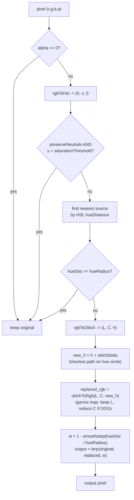

# change-image-theme

[中文](README.zh-CN.md)

A Node.js CLI for **theming / reskinning** PNG/JPG assets: given a hex color map, it shifts the brand hue and all its light/dark variants to a new hue. Built for **rebrand, white-label, and multi-theme skins** rather than literal per-pixel color replacement. The algorithm uses a **hybrid HSL matching + OKLCH transform**: HSL hue classifies pixels to replace; OKLCH rotates hue while preserving perceptual lightness (L) and chroma (C).

- **HSL hue matching**: Pixels are classified as brand color (and variants) by HSL hue distance — stable grouping, consistent with main-branch behavior
- **OKLCH hue rotation**: Matched pixels rotate hue in OKLCH space, preserving each pixel's original **perceptual lightness** (L) and chroma (C)
- **Neutral preservation**: Low-saturation (HSL S) pixels (white/gray/black) are skipped so text and backgrounds stay intact
- **Gamut mapping**: If rotation pushes a color out of sRGB, **keep L, reduce C** per CSS Color 4 to avoid lightness jumps
- **Soft boundaries**: smoothstep at the hue-radius edge for smooth transitions, no hard color blocks
- **Full alpha preserved** (PNG output)
- **Batch directory processing**: recursive by default, preserves directory structure, concurrent file processing

## Installation

```bash
npm install
npm run build
# Optional: global link (CLI command name is cit)
npm link
```

When published to npm the package name is `change-image-theme`; locally you can use `npx change-image-theme …` (equivalent to the global `cit` command — both point to the same entry).

Run TypeScript source directly in dev mode:

```bash
npm run dev -- input.png -o output.png -m examples/mapping.json
```

## Color map

A JSON file where keys are source colors (hex) and values are target colors (hex). Supports `#rgb` and `#rrggbb`:

```json
{
  "#514cf9": "#f05416"
}
```

> **Important**: You are not mapping exact pixel colors — you are defining the brand's **representative hue**. The algorithm uses **HSL hue** to decide which pixels to change, and the **OKLCH hue delta** between the map's source and target as the rotation angle; each pixel keeps its own OKLCH lightness (L) and chroma (C). So pure brand `#514cf9` may not become exactly `#f05416`, but all its light/dark variants (dark purple icons, light purple backgrounds, brand buttons, etc.) shift to the orange hue while **preserving the original lightness rhythm**. If you need "this exact color becomes that exact color", this tool is not the right fit.

## Usage

### Single file

```bash
cit banner.png \
  -o banner-rebrand.png \
  -m examples/mapping.json
```

### Entire directory (recursive by default, preserves structure)

```bash
cit ./assets \
  -o ./assets-rebrand \
  -m examples/mapping.json
```

### Adjust hue tolerance

`-r` / `--hue-radius` controls how close in hue a pixel must be to count as the same brand color (degrees, 0–180):

```bash
# Only replace pixels very close to the source hue (conservative)
cit in.png -o out.png -m map.json -r 15

# Default: covers brand variants without affecting neighboring hues
cit in.png -o out.png -m map.json

# Also swap neighboring hues (permissive)
cit in.png -o out.png -m map.json -r 60
```

### Neutral preservation threshold

`-t` / `--saturation-threshold` defaults to `0.1`. Pixels with **HSL saturation** below this are treated as neutrals and left unchanged. If very light brand tints are misclassified as neutral, lower the value:

```bash
cit in.png -o out.png -m map.json -t 0.05
```

Special case: to also recolor whites/grays, use `--no-preserve-neutrals`:

```bash
cit in.png -o out.png -m map.json --no-preserve-neutrals
```

### Inline JSON map

```bash
cit in.png -o out.png -m '{"#514cf9":"#f05416"}'
```

### Verbose output

```bash
cit in.png -o out.png -m map.json -v
```

Example output:

```
OK  banner1.png (1200x720, affected 857302/858480 (skipped: neutral=263, far=743, transparent=172))
     #514cf9: 857302 px
```

## All CLI options

| Option | Default | Description |
|---|---|---|
| `<input>` | – | Input file or directory (required positional) |
| `-o, --output <path>` | – | Output file or directory (required; must be a directory when input is a directory) |
| `-m, --map <jsonOrPath>` | – | Color map: path to a JSON file, or inline JSON starting with `{` |
| `-r, --hue-radius <degrees>` | `30` | HSL hue distance radius (0–180°); pixels within range rotate toward the target hue with smoothstep falloff at the edge |
| `-t, --saturation-threshold <number>` | `0.1` | Pixels with HSL saturation below this are treated as neutral and unchanged (range 0–1) |
| `--no-preserve-neutrals` | – | Disable neutral preservation |
| `--no-recursive` | – | Disable recursion in directory mode |
| `-c, --concurrency <number>` | CPU core count | Batch concurrency (directory mode) |
| `-v, --verbose` | `false` | Print hit counts per source color |

## Algorithm details

### Pipeline


```mermaid
flowchart TD
  P["pixel (r,g,b,a)"] --> A{"alpha == 0?"}
  A -->|yes| Keep[keep original]
  A -->|no| HSL["rgbToHsl -> (h, s, l)"]
  HSL --> N{"preserveNeutrals AND<br/>s < saturationThreshold?"}
  N -->|yes| Keep
  N -->|no| F["find nearest source<br/>by HSL hueDistance"]
  F --> R{"hueDist >= hueRadius?"}
  R -->|yes| Keep
  R -->|no| OK["rgbToOklch -> (L, C, h)"]
  OK --> Rot["new_h = h + oklchDelta<br/>(shortest path on hue circle)"]
  Rot --> Back["replaced_rgb = oklchToRgb(L, C, new_h)<br/>(gamut map: keep L, reduce C if OOG)"]
  Back --> Blend["w = 1 - smoothstep(hueDist / hueRadius)<br/>output = lerp(original, replaced, w)"]
  Blend --> Out[output pixel]
```

### Key points

- **HSL match, OKLCH transform**: Classification uses HSL hue (aligned with CSS/design tools); transformation keeps L and C in OKLCH and only rotates hue — perceptual lightness stays constant across hues.
- **Shortest-path hue rotation**: The OKLCH hue delta between map endpoints (e.g. source `h=275.5°` → target `h=38.4°`, delta `+122.9°`) is applied to each matched pixel.
- **Gamut mapping**: Light colors + rotation can fall outside sRGB (OKLCH is a superset of sRGB). The algorithm follows CSS Color Level 4: **keep L, binary-search reduce C** until in-gamut, then linear sRGB → sRGB conversion. Chroma drops slightly but lightness stays accurate — avoiding the "keep C, drop L" artifacts.
- **smoothstep edge falloff + sRGB blend**: Weight `1 - smoothstep(t)` where `t = hueDist / hueRadius`; final output is linear interpolation between original sRGB and rotated sRGB.
- **Neutral detection**: Pixels with HSL saturation S near 0 (white/gray/black) below `saturationThreshold = 0.1` are naturally skipped.

### Why HSL + OKLCH?

| Stage | Color space | Reason |
|---|---|---|
| Pixel classification (hue distance, neutrals) | **HSL** | Matches design tools/CSS hue; stable grouping for light variants |
| Hue rotation (preserve lightness rhythm) | **OKLCH** | L is true perceptual lightness, constant across hues; automatic gamut map (keep L, reduce C) |

Sample run on `examples/input.png` (brand purple icon with varied depth) → `examples/output.png`:

- Light purple `#9476fd` (OKLCH L≈0.61) → `#b9727d` (L≈0.61)
- Mid purple `#5b5bfa` (L≈0.55) → `#ca4300` (L≈0.55)
- Dark purple `#2f45f7` (L≈0.45) → `#a91f23` (L≈0.45)

The full image's lightness ladder matches the original; pure HSL rotation would brighten the output by ~5–10% (orange at the same L reads brighter than purple).

## Notes

- **JPG has no transparency**: Outputting `.jpg/.jpeg` flattens transparent pixels to black/white background (sharp default). Use `.png` to keep alpha.
- **Overwrite by name**: Directory mode overwrites output files by default for easy reruns.
- **Batch fault tolerance**: A single file failure only `console.error`s and increments a counter; the batch continues. Exit code `1` if any failures occurred.
- **Recolor whites/grays**: Pass `--no-preserve-neutrals`. Uncommon but the flag is available.
- **Multiple nearby source hues**: `findNearestByHue` picks the nearest source hue for rotation, so results stay deterministic even when brand hues are close.

## Project structure

```
src/
├── cli.ts         # CLI entry, arg parsing, directory dispatch, concurrency pool
├── color.ts       # hex<->RGB, HSL, OKLCH, gamut map, hue distance/delta
├── mapper.ts      # Map pre-parse (RGB & HSL & OKLCH & OKLCH hueDelta), findNearestByHue(HSL)
├── processor.ts   # Per-file pixel loop: HSL match -> OKLCH hue rotate -> gamut map -> sRGB blend
├── walker.ts      # Recursive directory scan
└── types.ts       # Types and default options
```

## License

MIT
