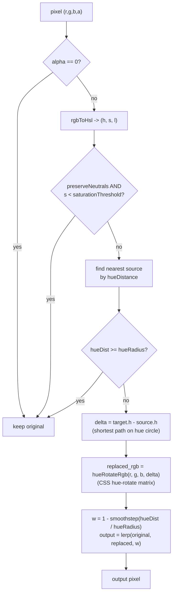

# change-images-theme

English | [简体中文](./README.zh-CN.md)

A Node.js CLI for **theming / reskinning** PNG/JPG assets: given a hex color map, it shifts the brand hue and all its light/dark variants to a new hue. Built for **rebrand, white-label, and multi-theme skins** rather than literal per-pixel color replacement. Pixels are classified by hue in HSL space, then recolored with the same RGB rotation matrix as CSS `hue-rotate` — avoiding the cross-hue lightness drift that comes from "change H only, keep S/L" in HSL.

- **HSL matching + hue-rotate transform**: Classify target pixels by HSL hue distance, then rotate RGB with the CSS `hue-rotate` matrix for more consistent perceived lightness
- **Neutral preservation**: Low-saturation pixels (white/gray/black) are naturally skipped so text and backgrounds stay intact
- **Soft boundaries**: smoothstep at the hue-radius edge for smooth transitions, no hard color blocks
- **Full alpha preserved** (PNG output)
- **Batch directory processing**: recursive by default, preserves directory structure, concurrent file processing

## Installation

```bash
npm install
npm run build
# Optional: global link (CLI command name is cit)
npm link
```

When published to npm the package name is `change-images-theme`; locally you can use `npx change-images-theme …` (equivalent to the global `cit` command — both point to the same entry).

Run TypeScript source directly in dev mode:

```bash
npm run dev -- input.png -o output.png -m examples/mapping.json
```

## Color map

A JSON file where keys are source colors (hex) and values are target colors (hex). Supports `#rgb` and `#rrggbb`:

```json
{
  "#514cf9": "#f05416"
}
```

> **Important**: You are not mapping exact pixel colors — you are defining the brand's **representative color**. The algorithm automatically covers all its light/dark variants. For example, swapping brand purple for brand orange also migrates dark purple icons, light purple backgrounds, and brand-colored buttons.

## Usage

### Single file

```bash
cit banner.png \
  -o banner-rebrand.png \
  -m examples/mapping.json
```

### Entire directory (recursive by default, preserves structure)

```bash
cit ./assets \
  -o ./assets-rebrand \
  -m examples/mapping.json
```

### Adjust hue tolerance

`-r` / `--hue-radius` controls how close in hue a pixel must be to count as the same brand color (degrees, 0–180):

```bash
# Only replace pixels very close to the source hue (conservative)
cit in.png -o out.png -m map.json -r 15

# Default: covers brand variants without affecting neighboring hues
cit in.png -o out.png -m map.json

# Also swap neighboring hues (permissive)
cit in.png -o out.png -m map.json -r 60
```

### Neutral preservation threshold

`-t` / `--saturation-threshold` defaults to `0.10`. Pixels with HSL saturation below this are treated as neutrals and left unchanged. If very light brand tints are misclassified as neutral, lower the value:

```bash
cit in.png -o out.png -m map.json -t 0.05
```

Special case: to also recolor whites/grays, use `--no-preserve-neutrals`:

```bash
cit in.png -o out.png -m map.json --no-preserve-neutrals
```

### Inline JSON map

```bash
cit in.png -o out.png -m '{"#514cf9":"#f05416"}'
```

### Verbose output

```bash
cit in.png -o out.png -m map.json -v
```

Example output:

```
OK  banner1.png (1200x720, affected 857302/858480 (skipped: neutral=263, far=743, transparent=172))
     #514cf9: 857302 px
```

## All CLI options

| Option | Default | Description |
|---|---|---|
| `<input>` | – | Input file or directory (required positional) |
| `-o, --output <path>` | – | Output file or directory (required; must be a directory when input is a directory) |
| `-m, --map <jsonOrPath>` | – | Color map: path to a JSON file, or inline JSON starting with `{` |
| `-r, --hue-radius <degrees>` | `30` | Hue distance radius (0–180°); pixels within range rotate toward the target hue with smoothstep falloff at the edge |
| `-t, --saturation-threshold <number>` | `0.10` | Pixels with HSL saturation below this are treated as neutral and unchanged (range 0–1) |
| `--no-preserve-neutrals` | – | Disable neutral preservation |
| `--no-recursive` | – | Disable recursion in directory mode |
| `-c, --concurrency <number>` | CPU core count | Batch concurrency (directory mode) |
| `-v, --verbose` | `false` | Print hit counts per source color |

## Algorithm details

### Pipeline


```mermaid
flowchart TD
  P["pixel (r,g,b,a)"] --> A{"alpha == 0?"}
  A -->|yes| Keep[keep original]
  A -->|no| H["rgbToHsl -> (h, s, l)"]
  H --> N{"preserveNeutrals AND<br/>s < saturationThreshold?"}
  N -->|yes| Keep
  N -->|no| F["find nearest source<br/>by hueDistance"]
  F --> R{"hueDist >= hueRadius?"}
  R -->|yes| Keep
  R -->|no| Rot["delta = target.h - source.h<br/>(shortest path on hue circle)"]
  Rot --> Back["replaced_rgb = hueRotateRgb(r, g, b, delta)<br/>(CSS hue-rotate matrix)"]
  Back --> Blend["w = 1 - smoothstep(hueDist / hueRadius)<br/>output = lerp(original, replaced, w)"]
  Blend --> Out[output pixel]
```

### Key points

- **hue-rotate, not HSL H-only**: Matching still uses HSL hue distance, but recoloring uses the CSS `hue-rotate` RGB rotation matrix instead of `hslToRgb(newH, s, l)`. The latter drifts perceived lightness across hues at the same S/L; hue-rotate matches the browser filter — light purple→light orange, dark purple→dark orange keep natural lightness relationships.
- **Shortest-path hue rotation**: Source `H=242°` → target `H=17°`, shortest delta is `+135°` (clockwise via red); every pixel within the radius rotates by the same angle.
- **smoothstep edge falloff + RGB blend**: Weight `1 - smoothstep(t)` where `t = hueDist / hueRadius`; final output is linear interpolation between original RGB and rotated RGB — avoiding odd intermediate hues.
- **Neutral detection**: HSL S (saturation) naturally measures "color purity"; low-saturation pixels (true white/gray/black) are not misclassified as any brand color.

### Why not RGB?

| Use case | RGB Euclidean distance | HSL hue distance |
|---|---|---|
| Exact color mapping (few discrete colors + anti-aliasing noise) | Simple and intuitive | Requires HSL conversion |
| **Brand recolor (many lightness/saturation variants of one brand hue)** | ❌ Light purple `#e8e8f8` is distance 217 from `#514cf9` in RGB — indistinguishable from true gray | ✅ Light purple H=240°, brand purple H=242° — nearly same hue, natural grouping |
| Matching colors across lighting changes | ❌ Same hue, different lightness treated as different colors | ✅ Hue and lightness decoupled |

Tested: applying `#514cf9` → `#f05416` to 20 brand assets — HSL algorithm correctly migrated light purple backgrounds, dark purple icons, and pure brand buttons, while leaving cyan/blue/white/gray and other non-brand hues untouched.

## Notes

- **JPG has no transparency**: Outputting `.jpg/.jpeg` flattens transparent pixels to black/white background (sharp default). Use `.png` to keep alpha.
- **Overwrite by name**: Directory mode overwrites output files by default for easy reruns.
- **Batch fault tolerance**: A single file failure only `console.error`s and increments a counter; the batch continues. Exit code `1` if any failures occurred.
- **Recolor whites/grays**: Pass `--no-preserve-neutrals`. Uncommon but the flag is available.
- **Multiple nearby source hues**: `findNearestByHue` picks the nearest source hue for rotation, so results stay deterministic even when brand hues are close.

## Project structure

```
src/
├── cli.ts         # CLI entry, arg parsing, directory dispatch, concurrency pool
├── color.ts       # hex<->RGB, RGB<->HSL, hue distance/delta
├── mapper.ts      # Map pre-parse (RGB & HSL & hueDelta), findNearestByHue
├── processor.ts   # Per-file pixel loop: HSL match -> hue-rotate -> blend
├── walker.ts      # Recursive directory scan
└── types.ts       # Types and default options
```

## License

MIT
